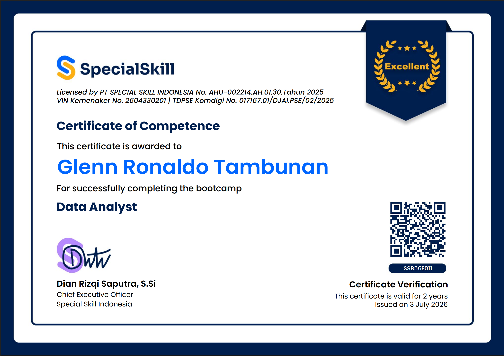
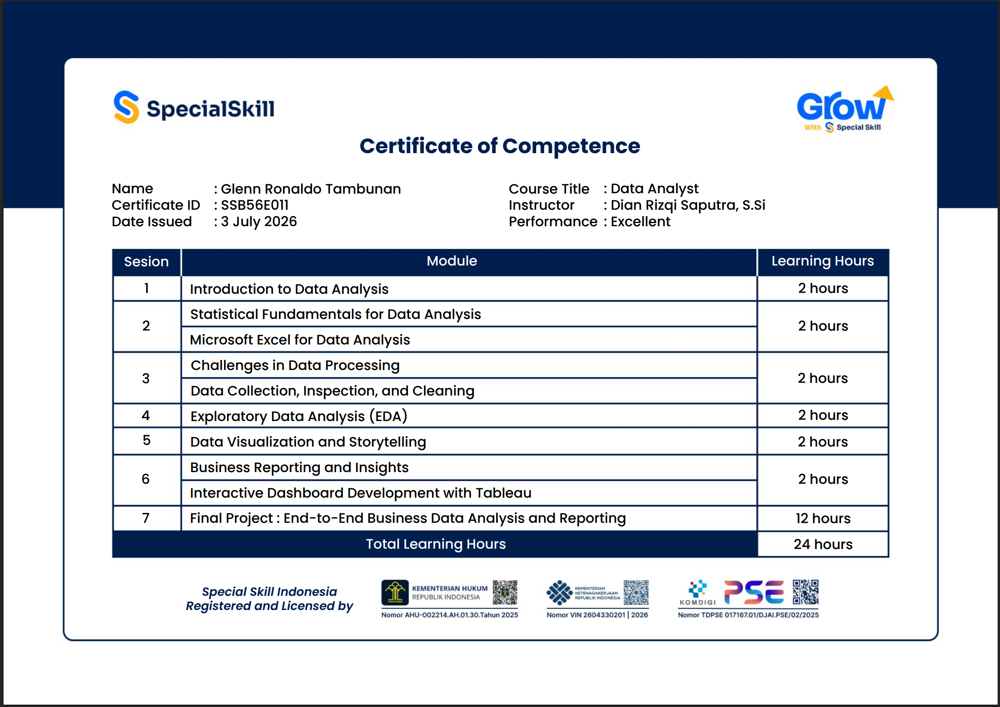
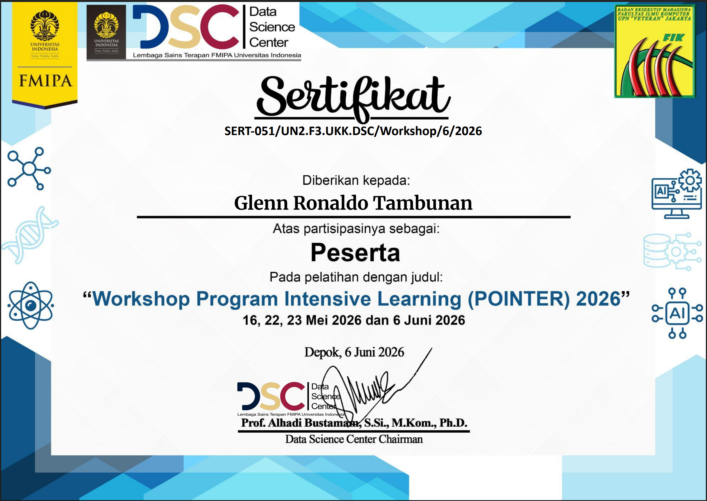
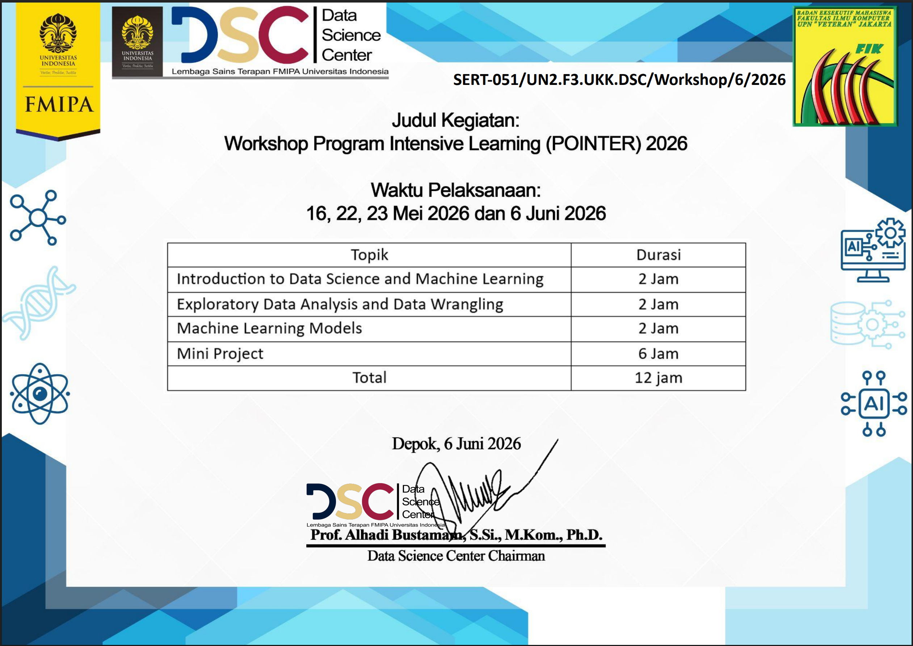
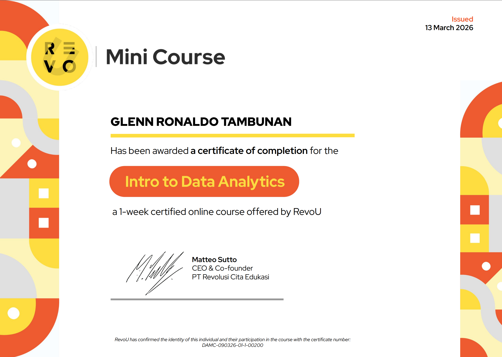
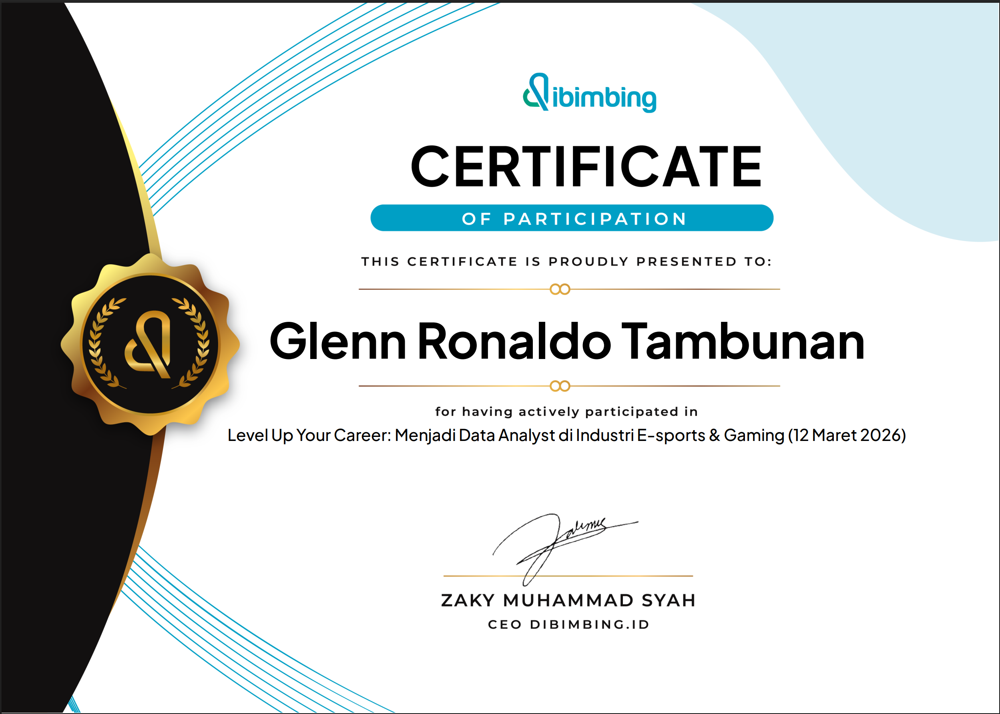

#<h1 align="center">Hi, I'm Glenn Ronaldo Tambunan 👋</h1>

<h3 align="center">Data Analyst and Business Intelligence Enthusiast</h3>

Information Systems student focused on transforming data into meaningful insights through analysis, visualization, and data-driven decision-making.

---

## About Me

- 🎓 Active fifth-semester Diploma student in Information Systems at the Faculty of Computer Science, UPN “Veteran” Jakarta.
- 📊 Interested in Data Analytics, Business Intelligence, Data Visualization, and Machine Learning.
- 🛠️ Experienced in data cleaning, exploratory data analysis, SQL querying, dashboard development, and machine learning through academic projects and bootcamps.
- 📈 Familiar with Microsoft Excel, SQL, Google BigQuery, Python, Tableau, and Google Looker Studio.
- 🔎 Currently seeking a Data Analyst or Business Intelligence internship to apply and further develop my analytical skills in a professional environment.

---

## Technical Skills

 

 

Data Cleaning • Exploratory Data Analysis • Data Visualization • Dashboard Development • Machine Learning

---

## Featured Projects

### 📊 Kitchen Equipment Sales Performance Analysis

An end-to-end sales analytics project developed during the KarirNex Data Analyst Bootcamp. The project involved data cleaning, SQL analysis, exploratory data analysis, and interactive dashboard development to evaluate sales, orders, refunds, products, and regional performance.

**Key Highlight:** Analyzed 2,156 completed orders that generated approximately IDR 1.30 billion in Q4 2025.

**Tools:** Microsoft Excel, Google BigQuery, SQL, Python, Pandas, Google Colab, Google Looker Studio

---

### 🛒 Retail Sales Analytical Report

An end-to-end retail sales analysis project developed during the SpecialSkill Data Analyst Bootcamp. The project involved data assessment, data cleaning, descriptive statistical analysis, exploratory data analysis, and data visualization to evaluate sales trends, product performance, customer characteristics, and purchasing patterns.

**Key Highlight:** Analyzed monthly sales fluctuations, product-category performance, customer distribution by gender and age group, and the relationship between purchase quantity and total transaction value.

**Tools:** Microsoft Excel, PivotTables, Excel Formulas, Charts, Data Visualization

---

### ❤️ Heart Disease Prediction Using Machine Learning

A collaborative mini project developed during the POINTER 2026 workshop to predict heart disease indications using clinical patient data. Seven classification algorithms were trained and compared using multiple model evaluation metrics.

**Key Highlight:** Selected K-Nearest Neighbors as the best-performing model with 88.4% accuracy and an 88.2% macro F1-score.

**Tools:** Python, Pandas, NumPy, Scikit-learn, Matplotlib, Seaborn, Google Colab

---

### ⛽ Fuel Sales Analysis and Business Intelligence Dashboard

Analyzed 500 fuel sales records through data cleaning, feature engineering, exploratory data analysis, and K-Means clustering. Developed two interactive Tableau dashboards to monitor sales KPIs, revenue trends, station performance, and transaction patterns.

**Key Highlight:** Identified two transaction clusters representing lower- and higher-value sales patterns.

**Tools:** Python, Pandas, NumPy, Matplotlib, Seaborn, Scikit-learn, Tableau Public, Microsoft Excel

---

### 📉 Telco Customer Churn Prediction

A collaborative machine learning project analyzing 7,043 telecommunications customer records using the Knowledge Discovery in Databases framework. Developed and compared Logistic Regression and Decision Tree models to classify customers as churn or non-churn.

**Key Highlight:** Identified a 41.68% churn rate among Senior Citizen customers, compared with 23.61% among Non-Senior Citizen customers.

**Tools:** Python, Pandas, NumPy, Scikit-learn, Matplotlib, Seaborn, Google Colab

---

### 👥 University Workforce Analytics Dashboard

A collaborative data visualization project analyzing 725 university employee records across 16 attributes. Developed three interactive dashboards presenting workforce demographics, employment status, academic positions, faculty distribution, and employee certification patterns.

**Key Highlight:** Identified a 93.4% active employee rate and found that 56.7% of employees had not yet obtained certification.

**Tools:** Microsoft Excel, Tableau Public

---

## Certifications and Training

<b>Data Analyst Bootcamp, KarirNex by PT Ebiz Karisma Internasional</b>

 

Completed a 20-hour bootcamp covering Microsoft Excel, SQL using Google BigQuery, Python using Google Colab, data cleaning, data visualization, and dashboard development using Google Looker Studio.

**Achievement:** Expert competency level  
**Issued:** July 2026

  
    
  
    
  

 

<b>Data Analyst Bootcamp, SpecialSkill Indonesia</b>

 

Completed a 24-hour bootcamp covering statistical fundamentals, Microsoft Excel, data cleaning, exploratory data analysis, data visualization, business reporting, and interactive dashboard development using Tableau.

**Achievement:** Excellent performance rating  
**Issued:** July 2026

  
    
  

 

<b>Program Intensive Learning Workshop (POINTER) 2026, Data Science Center Universitas Indonesia</b>

 

Completed a 12-hour intensive workshop covering data science fundamentals, exploratory data analysis, data wrangling, machine learning models, model evaluation, and a collaborative mini project.

**Mini Project:** Heart Disease Prediction Using Machine Learning  
**Issued:** June 2026

  
    
  

 

<b>Intro to Data Analytics, RevoU</b>

 

Completed a one-week certified online course covering data analytics fundamentals and practical analysis using a PUBG Mobile dataset.

**Issued:** March 2026

  

 

<b>Becoming a Data Analyst in the E-sports and Gaming Industry, Dibimbing.id</b>

 

Participated in a learning session covering the role, career path, required competencies, and application of data analytics in the e-sports and gaming industry.

**Issued:** March 2026

  

---

## GitHub Statistics

  
  

  <i>Statistics are generated from public GitHub repositories.</i>

---

## Contact and CV

  

  

  

  Open to internship opportunities in Data Analytics and Business Intelligence.

---

  Thank you for visiting my GitHub profile.

